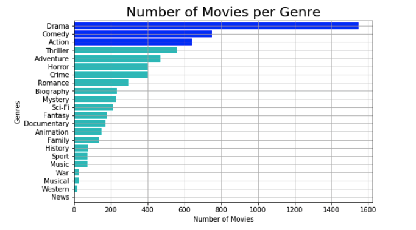

# Module 1 Final Project

## Microsoft Movie Studio

### Table of Contents

-[Description](#description)
-[Datasets](#datasets)
-[Data Merging and Cleaning](#datamergingandcleaning)
-[Questions](#questions)
-[Conclusion](#conclusion)

## Description

Microsoft is creating a new movie studio and they need information on successful movies. 
For this project, the most common genres produced with the highest average rating, popularity, and profit would be considered the most successful genres.

## Datasets
Sources Used:

* IMDB
      - Data for genres, movies, rating, popularity, and length of a movie.
* TheMovieDB.org
      - Data for budget and profit.

## Data Merging and Cleaning

* Merging all the data together.
* Cleaning the data by either dropping or replacing the missing values. 
* Dropping duplicated movie titles.

## Questions

1. Which are the top 3 most commonly used movie genres made after 2010.
2. Which genres have the highest average rating and average popularity, and what is their correlation with the top 3 movie genres produced?
3. Which genres have the highest average profits, and does production budget have an effect on the profit?
4. How are average rating, popularity, and the length of a movie linked to the profit of a movie?

## Conclusion

* All questions are answered with bar plot and/or scatter graphs.
* No genre confirms to be outstanding in all criteria used for this project.
* Action and Adventure are the top two genres with higher values in two categories- popularity and profit. 
* The strongest correlation with respect to profit is budget.

 

